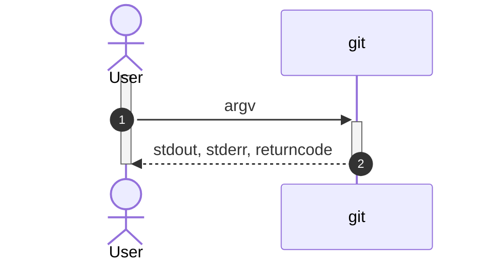
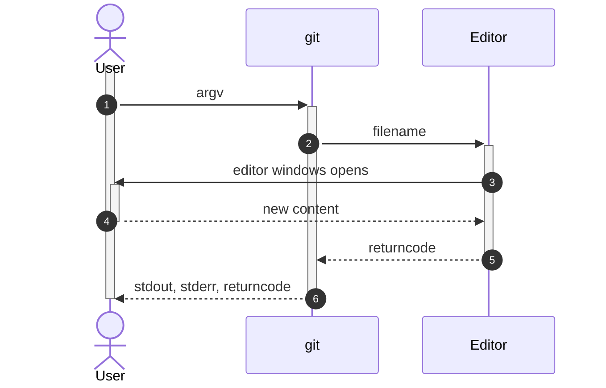
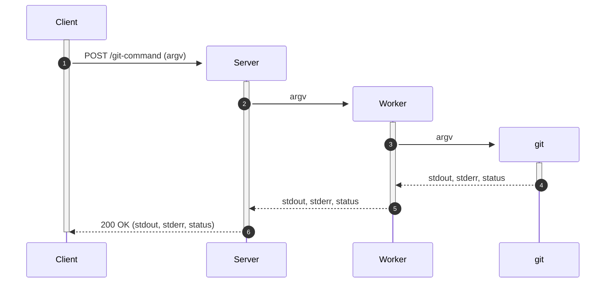
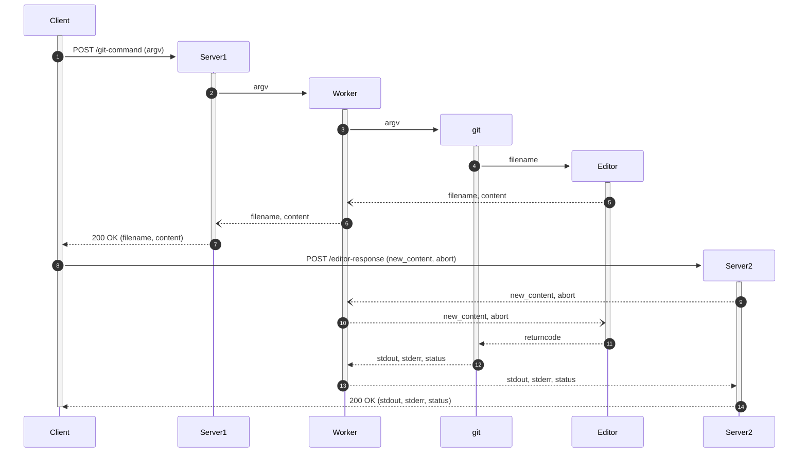
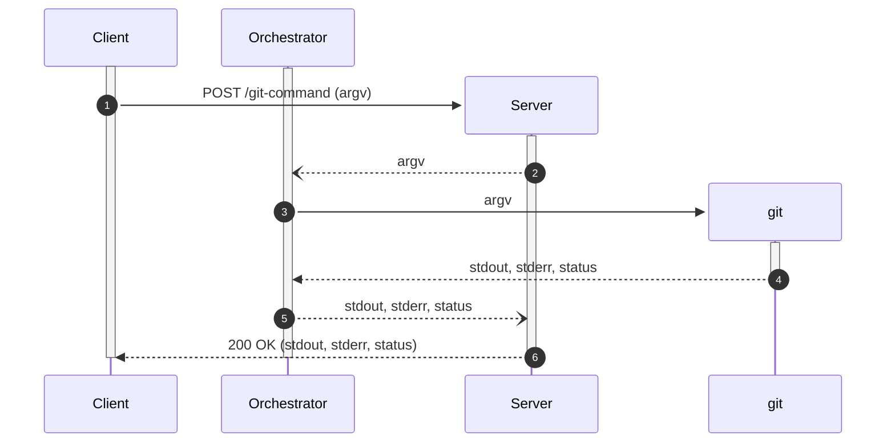
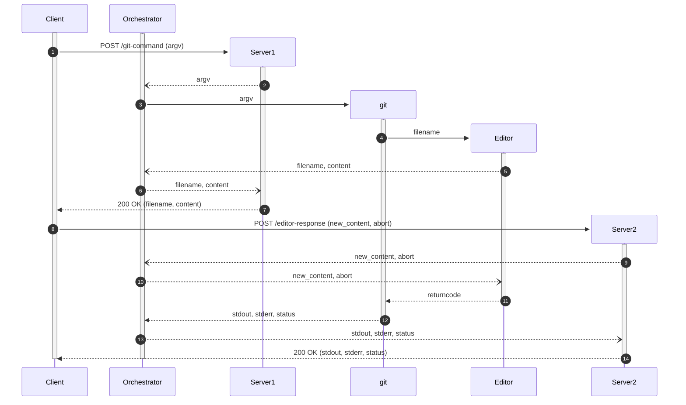

# Git Communication

## Local

### Non-Editor Command

### Editor Command

## Client-Server

### Non-Editor Command

### Editor Command

### Non-Editor Command with Orchestrator

### Editor Command with Orchestrator

