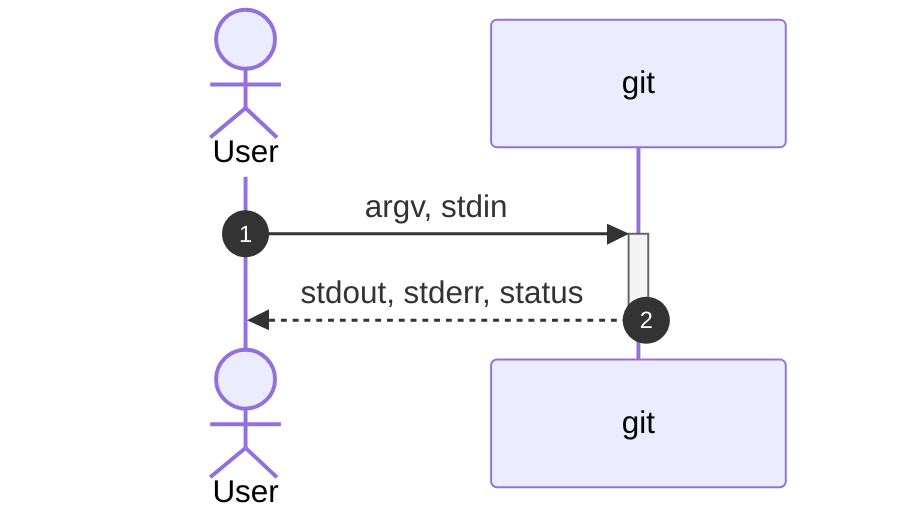
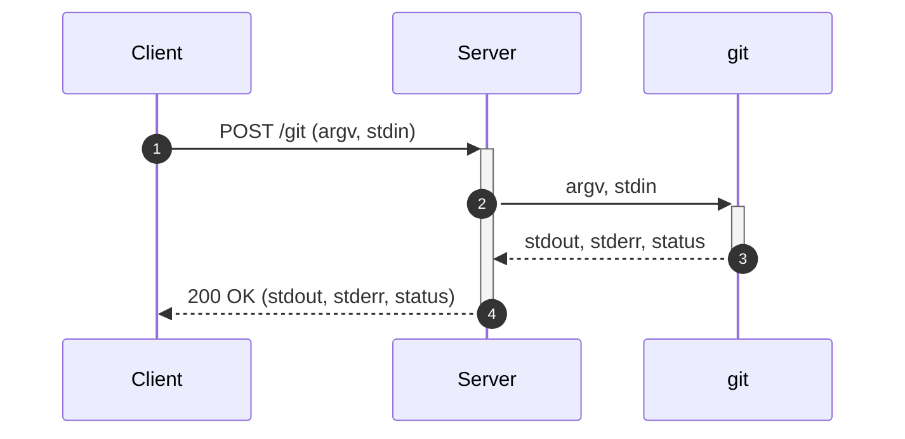
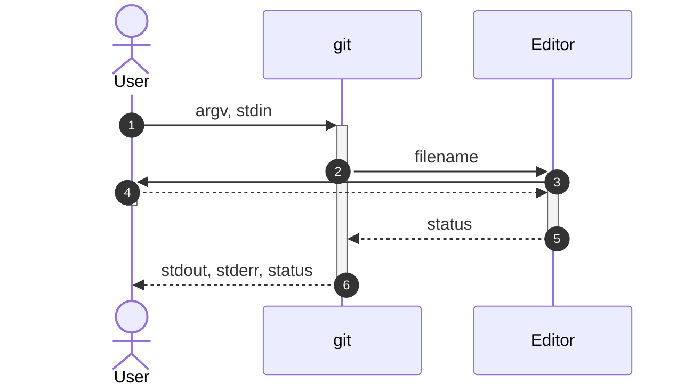
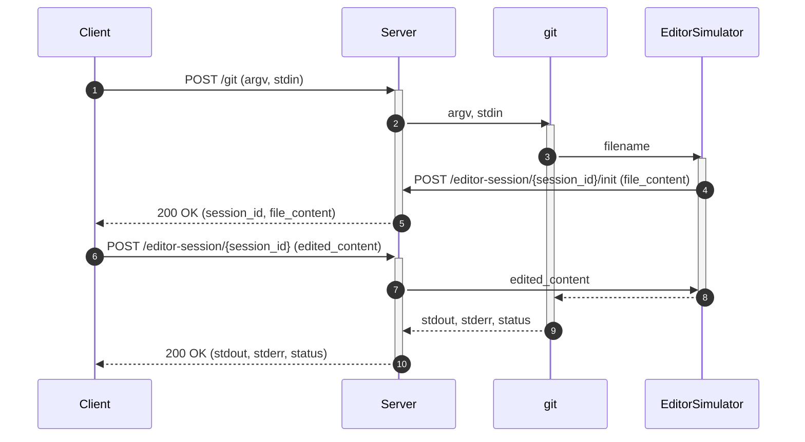
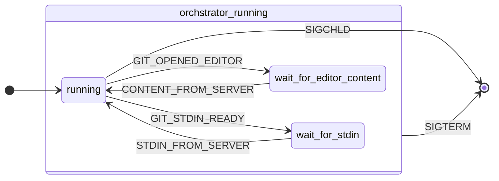
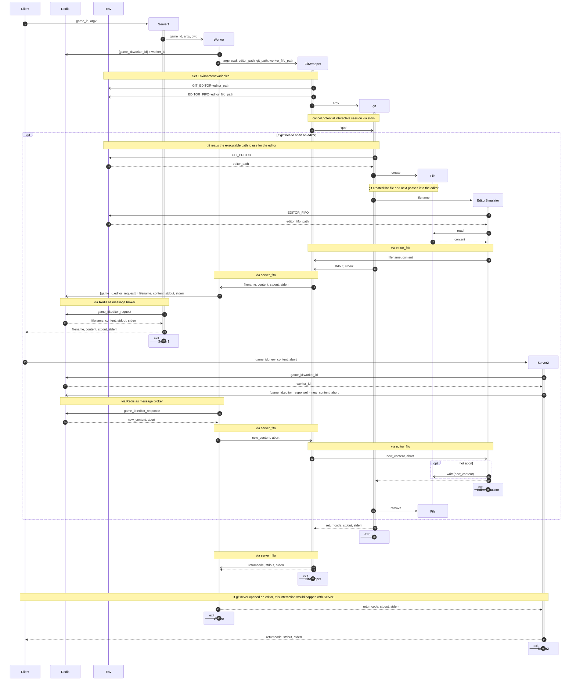

# git Communication

## Non-Editor git command

### Local

```mermaid
sequenceDiagram
    autonumber
    actor User
    participant git

    User ->>+ git: argv, stdin
    git -->>- User: stdout, stderr, status
```
### Server

```mermaid
sequenceDiagram
    autonumber
    participant Client
    participant Server
    participant git
    
    Client ->>+ Server: POST /git (argv, stdin)

        Server ->>+ git: argv, stdin

        git -->>- Server: stdout, stderr, status

    Server -->>- Client: 200 OK (stdout, stderr, status)
```

## Editor git command

### Local

```mermaid
sequenceDiagram
    autonumber
    actor User
    participant git
    participant Editor

    User ->>+ git: argv, stdin
        git ->>+ Editor: filename
            Editor ->>+ User:
            User -->>- Editor:
        Editor -->>- git: status
    git -->>- User: stdout, stderr, status
```

### Server

```mermaid
sequenceDiagram
    autonumber
    participant Client
    participant Server
    participant git
    participant EditorSimulator

    Client ->>+ Server: POST /git (argv, stdin)
        Server ->> git: argv, stdin
            activate git
            git ->> EditorSimulator: filename
        activate EditorSimulator
        EditorSimulator ->> Server: POST /editor-session/{session_id}/init (file_content)
    Server -->>- Client: 200 OK (session_id, file_content)

    Client ->>+ Server: POST /editor-session/{session_id} (edited_content)
        Server ->> EditorSimulator: edited_content
            EditorSimulator -->> git: 
            deactivate EditorSimulator


        git -->> Server: stdout, stderr, status
        deactivate git
    Server -->>- Client: 200 OK (stdout, stderr, status)
```

## git Orchestrator State Diagram

```mermaid
stateDiagram-v2
    direction LR

    [*] --> running

    state orchstrator_running {
        running --> wait_for_stdin: GIT_STDIN_READY
        running --> wait_for_editor_content: GIT_OPENED_EDITOR

        wait_for_stdin --> running: STDIN_FROM_SERVER

        wait_for_editor_content --> running: CONTENT_FROM_SERVER
    }
    
    running --> [*]: SIGCHLD

    orchstrator_running --> [*]: SIGTERM
```

## Sequence Diagram

```mermaid
sequenceDiagram
    autonumber

    participant Client
    participant Redis
    participant Env

    create participant Server1
    Client ->> Server1: game_id, argv
        activate Server1

        create participant Worker
        Server1 -) Worker: game_id, argv, cwd
            activate Worker

            Worker -) Redis: [game_id:worker_id] = worker_id

            create participant GitWrapper
            Worker -) GitWrapper: argv, cwd, editor_path, git_path, worker_fifo_path
                activate GitWrapper

                Note over GitWrapper,Env: Set Environment variables
                GitWrapper -) Env: GIT_EDITOR=editor_path
                GitWrapper -) Env: EDITOR_FIFO=editor_fifo_path

                create participant git
                GitWrapper -) git: argv
                    activate git

                Note over GitWrapper,git: cancel potential interactive session via stdin
                GitWrapper -) git: "q\n"
            
    opt If git tries to open an editor

                    Note over git,Env: git reads the executable path to use for the editor
                    git ->> Env: GIT_EDITOR
                    Env -->> git: editor_path

                    create participant File
                    git -) File: create

                    Note over git,File: git created the file and next passes it to the editor

                    create participant EditorSimulator
                    git ->> EditorSimulator: filename
                        activate EditorSimulator

                        EditorSimulator ->> Env: EDITOR_FIFO
                        Env -->> EditorSimulator: editor_fifo_path

                        EditorSimulator ->> File: read
                        File -->> EditorSimulator: content

                Note over EditorSimulator,GitWrapper: via editor_fifo
                EditorSimulator -) GitWrapper: filename, content

            git -) GitWrapper: stdout, stderr

            Note over GitWrapper,Worker: via server_fifo
            GitWrapper -) Worker: filename, content, stdout, stderr

            Worker -) Redis: [game_id:editor_request] = filename, content, stdout, stderr

        Note over Server1,Redis: via Redis as message broker
        Server1 ->> Redis: game_id:editor_request
        Redis -->> Server1: filename, content, stdout, stderr

    Server1 -->> Client: filename, content, stdout, stderr
    deactivate Server1
    destroy Server1
    Server1 -x Server1: exit

    create participant Server2
    Client ->> Server2: game_id, new_content, abort
        activate Server2

        Server2 ->> Redis: game_id:worker_id
        Redis -->> Server2: worker_id

        Server2 -) Redis: [game_id:editor_response] = new_content, abort

            Note over Worker,Redis: via Redis as message broker
            Worker ->> Redis: game_id:editor_response
            Redis -->> Worker: new_content, abort

            Note over Worker,GitWrapper: via server_fifo
            Worker -) GitWrapper: new_content, abort

                Note over GitWrapper,EditorSimulator: via editor_fifo
                GitWrapper -) EditorSimulator: new_content, abort

                    opt not abort

                        EditorSimulator -) File: write(new_content)

                    end

                EditorSimulator -->> git: 
                deactivate EditorSimulator
                destroy EditorSimulator
                EditorSimulator -x EditorSimulator: exit

            destroy File
            git -x File: remove

end

            git -->> GitWrapper: returncode, stdout, stderr
            deactivate git
            destroy git
            git -x git: exit

        Note over GitWrapper,Worker: via server_fifo
        GitWrapper -) Worker: returncode, stdout, stderr
        GitWrapper -->> Worker: 
        deactivate GitWrapper
        destroy GitWrapper
        GitWrapper -x GitWrapper: exit

    Note over Server2,Client: If git never opened an editor, this interaction would happen with Server1
    Worker -->> Server2: returncode, stdout, stderr
    deactivate Worker
    destroy Worker
    Worker -x Worker: exit

    Server2 -->> Client: returncode, stdout, stderr
    deactivate Server2
    destroy Server2
    Server2 -x Server2: exit
```